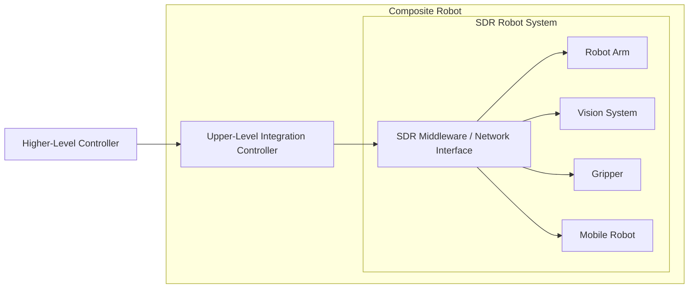

# Integration

MINTROBOT robots are designed as SDR robots, which means they are intended to operate not only as standalone products but also as components inside a larger robot system.

In this model, the SDR robot system is one composite robot. Inside that composite robot, the upper-level integration controller coordinates each robot element through a network-oriented middleware environment. That integration controller may itself receive commands from a higher-level controller.

In this architecture, the upper-level integration controller inside the composite robot can coordinate multiple robot elements such as:

- robot arms
- vision systems
- grippers
- mobile platforms

This makes integration a core part of the product concept rather than an optional add-on.

## Integration Model

In a typical deployment, the system-level coordinator exists inside the composite robot as the upper-level integration controller.

That controller may:

- execute motion or task logic inside the robot controller
- call the robot remotely through network APIs
- coordinate multiple robot devices in one unified application

At the same time, the composite robot itself can be connected to a higher-level controller above it.

This means the same architecture can scale upward:

- robot elements are integrated inside the composite robot
- the composite robot is controlled by its own integration controller
- that composite robot can then become one controllable unit inside a larger system

## Why It Matters

This approach allows MINTROBOT products to function as part of a broader SDR robot system.

Instead of treating each robot as an isolated machine, the robot system can be organized as a composite unit with its own internal integration layer, while still remaining connectable to a higher-level system above it.
