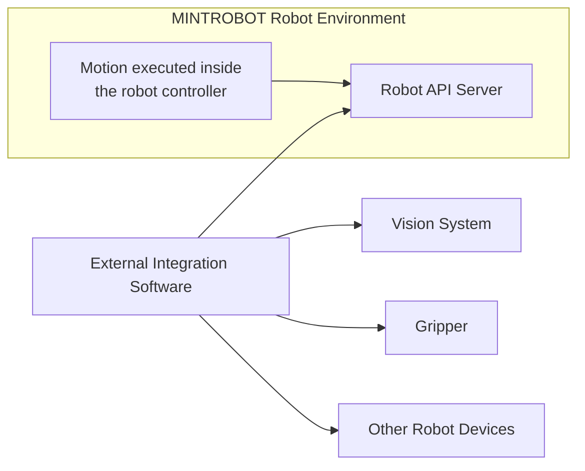

# Remote Control

MINTROBOT robots can be integrated with external upper-level control software through network-based remote control.

This is important when the robot must operate together with other system components instead of running only self-contained logic inside the controller.

## Internal Execution and External Control

The robot controller can execute logic internally through Motion Bank and the built-in scripting environment.

However, when a higher-level controller must manage the robot together with other peripheral or robotic devices, external remote control becomes the more appropriate model.

## SDR Integration Meaning

In an SDR system, the robot is one controllable software-defined component among many.

The upper-level software can coordinate:

- robot-side motion execution
- remote API calls
- device-to-device timing
- multi-robot task orchestration

## Practical Integration Patterns

Typical patterns include:

- sending remote commands to a robot from an external application
- triggering motion files that already exist inside the robot controller
- coordinating robot motion with a vision result or sensor event
- controlling multiple robots from one external system

## Why This Fits MINTROBOT

MINTROBOT products are intended to participate in larger SDR robot systems.

That is why remote control is not just a convenience feature. It is a necessary integration mechanism for building composite robot systems and unified automation software.

## API Reference

This page explains the remote-control concept and the integration role of MINTROBOT robots.

For detailed API usage, controller-side function calls, and implementation-level reference, see the Stellar documentation here:

- [Remote Control Overview](../../../../stellar-docs/docs/manual/remote_control/understanding_remote_control/index.md)
- [API Reference](../../../../stellar-docs/docs/manual/apis/index.md)
