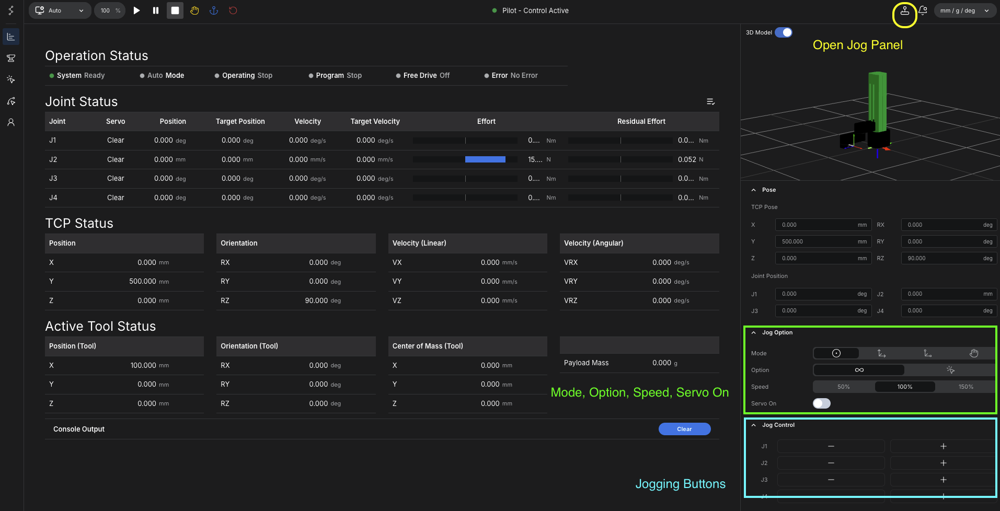

# Jogging

Jogging is the most basic manual operation mode for the cylindrical robot arm.

It is used to confirm that the robot is connected correctly, that each axis responds as expected, and that the robot is ready for teaching.

## Basic Flow

1. Open Motion Studio in the browser.
2. Confirm that the robot is connected and ready.
3. Open the jog panel from the main screen.
4. Turn servo on if required by the controller state.
5. Select the required jog mode.
6. Set the desired jog option and speed.
7. Move each axis or coordinate direction at low speed.
8. Confirm that the robot moves in the expected direction.

## Open the Jog Panel

The jog panel is opened from the main screen of the controller interface.

<figure markdown="span">
  { width="1200" }
  <figcaption>Main screen with the jog panel open, including the jog entry point, servo state, mode, option, and speed controls</figcaption>
</figure>

Once the jog panel is open, the operator can turn `Servo On` and begin manual motion control.

## Servo On

Before the robot can move, servo power must be enabled.

Turn `Servo On` in the jog interface, then confirm that the robot is ready for motion before giving any jog command.

## Jog Panel Functions

The jog panel is organized around three main functions:

- `Mode`
- `Option`
- `Speed`

### Mode

The jog mode determines how movement commands are interpreted.

- `Joint`: moves each robot axis directly by joint command
- `TCP`: moves the tool center point relative to the base coordinate system
- `Tool TCP`: moves the tool center point relative to the tool coordinate system
- `Hand Teaching`: allows direct hand-guided teaching if the controller and robot state support it

For first-time checking of the cylindrical robot arm, `Joint` mode is usually the safest place to start because each axis can be verified independently.

### Option

The jog option determines how the movement button behaves.

- continuous move: the robot keeps moving while the operator holds the button
- tick move: the robot moves by a small step each time the button is pressed

Continuous move is useful for rough positioning. Tick move is useful when fine adjustment is required.

### Speed

The speed setting determines how fast the robot moves during jogging.

Low speed should be used for first connection checks, initial testing, and fine teaching work.

Higher speed can be used only after motion direction and working clearance are already confirmed.

## Recommended First Check

When jogging for the first time:

- move one axis at a time
- use low speed
- confirm that each movement matches the expected physical direction
- stop immediately if motion direction or response is not as expected
