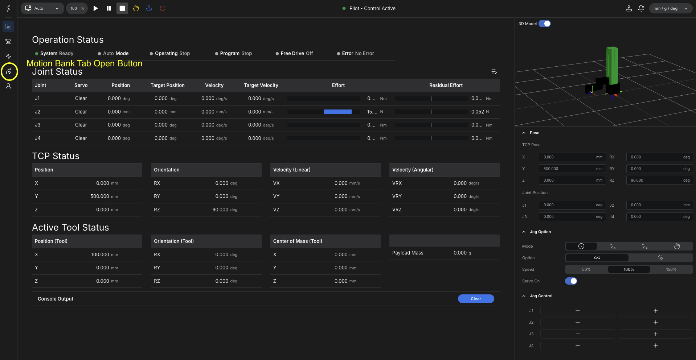
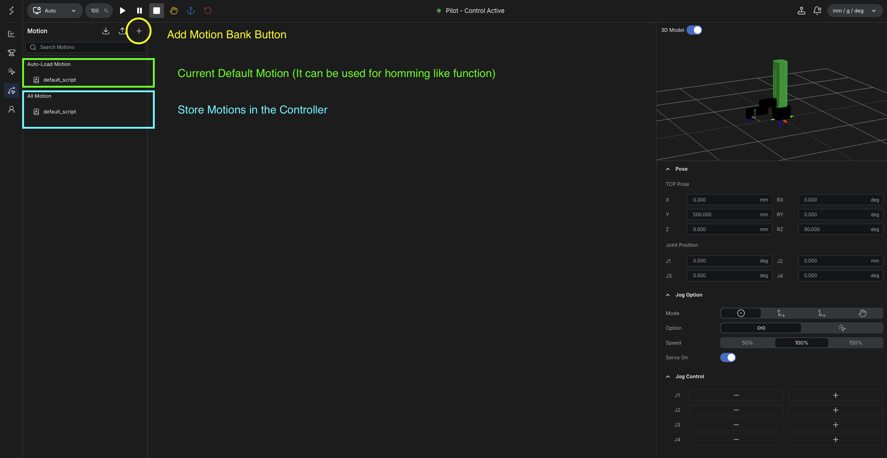
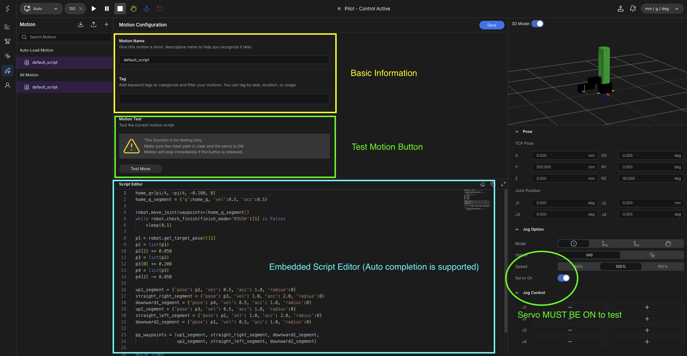

# Motion Bank

Motion Bank is the execution layer used to organize and run robot motion programs.

In practical terms, it corresponds to the teach program concept used in traditional industrial manipulators.

For example, if a conventional robot system uses a teach program or a controller-specific script such as a UR program, Motion Bank plays a similar role here.

## What Makes It Different

The difference is that Motion Bank uses standard Python-based motion scripts.

The editor is built directly into the GUI, so the operator can create, edit, save, and execute motion scripts inside the controller interface without moving to a separate external tool.

## Relationship with Pose Bank

Motion Bank is usually used after poses have already been prepared in Pose Bank.

In that workflow:

- Pose Bank stores the reusable robot poses
- Motion Bank uses those saved poses inside an executable motion script

This allows operators to build repeatable motion behavior on top of previously taught data.

## Basic Flow

1. Open Motion Bank from the controller interface.
2. Create a new motion file.
3. Write or edit the Python motion script in the built-in editor.
4. Load the required pose data from Pose Bank if needed.
5. Save the motion file.
6. Execute the motion from the controller interface.

<figure markdown="span">
  { width="1200" }
  <figcaption>Open the Motion Bank tab from the main screen</figcaption>
</figure>

<figure markdown="span">
  { width="1200" }
  <figcaption>Current default motion, stored motions in the controller, and the button used to add a new motion entry</figcaption>
</figure>

## Built-In Editor

The built-in editor allows the operator to write motion logic directly inside the controller GUI.

This is useful because:

- motion files can be created and managed in one place
- pose data and script logic stay close together
- program changes can be tested quickly on the same interface

<figure markdown="span">
  { width="1200" }
  <figcaption>Motion configuration, test motion control, and the embedded Python script editor. Servo On must be enabled before testing motion.</figcaption>
</figure>

## Typical Motion Workflow

A common workflow is:

1. save important positions in Pose Bank
2. create a motion file in Motion Bank
3. load saved pose data inside the script
4. define the required motion sequence
5. save and execute the script

This makes Motion Bank the place where taught positions are turned into an executable robot program.

## Typical Use Cases

Motion Bank is typically used when:

- the same motion path must be repeated
- multiple saved poses must be linked into a sequence
- motion behavior must be edited or improved over time
- an external system needs a prepared motion file to trigger

## Additional Reference

The detailed scripting model and controller-side motion API can be referenced through the corresponding `stellar-docs` Motion documentation when needed.
