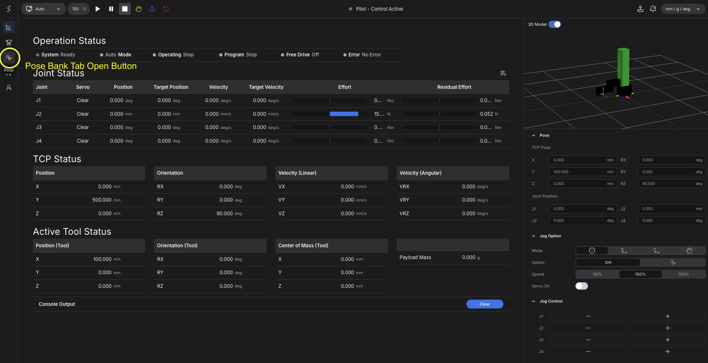
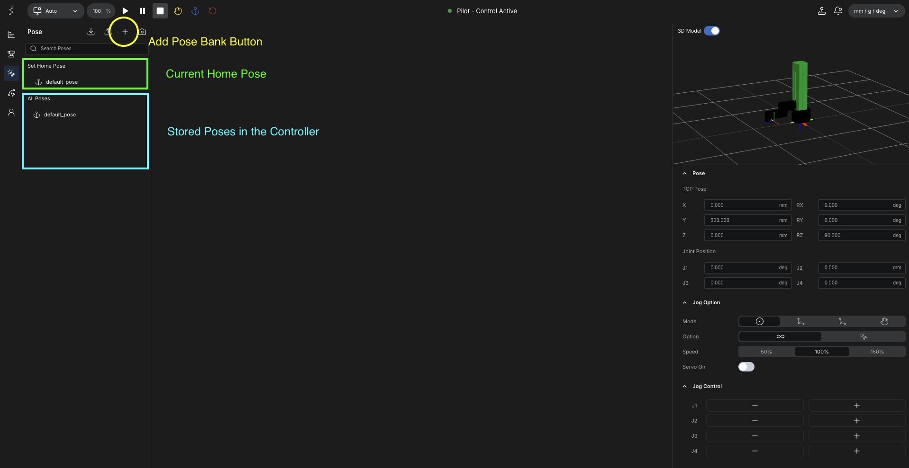
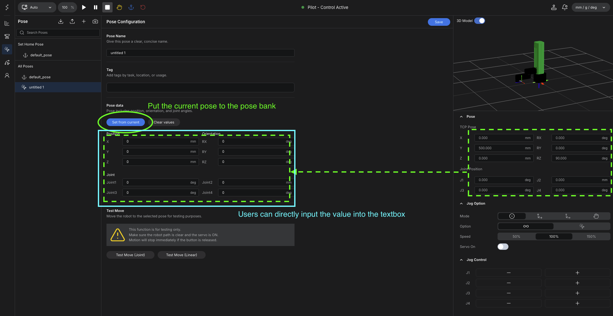
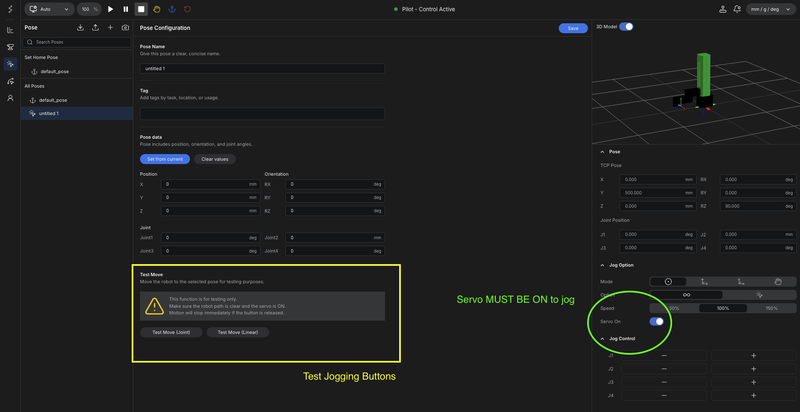

# Pose Bank

Pose Bank is used to store robot poses that can be recalled later for testing, teaching, or motion execution.

For the cylindrical robot arm, this is useful when teaching repeated points for service tasks, pick-and-place positions, inspection points, or predefined home positions.

## What a Pose Means

A pose describes a specific robot posture.

In practice, a pose is understood through two kinds of information:

- joint-based values, which describe the robot by axis position
- TCP-based values, which describe the end position and orientation of the robot tool

This is important because operators may think about a target either as a robot posture or as a task-space position.

<figure markdown="span">
  { width="1200" }
  <figcaption>Open the Pose Bank tab from the main screen</figcaption>
</figure>

## Pose Bank Concept

Like Tool Bank, Pose Bank is a storage area where multiple poses can be saved and reused.

This allows operators to:

- save important working positions
- organize repeatable path points
- recall previously taught poses without re-entering values
- build motion sequences from stored positions

<figure markdown="span">
  { width="1200" }
  <figcaption>Current home pose and stored poses in the controller, including the button used to add a new pose entry</figcaption>
</figure>

## Two Ways to Save a Pose

There are two practical ways to create and save a pose in Pose Bank.

### 1. Direct Value Input

The first method is to enter the pose values directly.

This is useful when the target values are already known.

Typical use cases include:

- home position setting
- predefined standby positions
- standard reference positions

### 2. Capture from Current Robot Position

The second method is to move the robot first, then capture the current robot position into Pose Bank.

This is useful when the operator wants to secure real path points by physically moving the robot.

Typical use cases include:

- teaching working points
- securing approach points
- collecting path points through real robot movement

When used together with hand teaching, this method makes it possible to secure robot poses very quickly.

<figure markdown="span">
  { width="1200" }
  <figcaption>Two ways to define a pose: direct value input or bringing in the current robot state with Set from current</figcaption>
</figure>

## Basic Flow

1. Create or open a pose entry in Pose Bank.
2. Either enter pose values directly or move the robot first.
3. If the robot was moved physically, capture the current robot state into the pose entry.
4. Save the pose.
5. Review the stored joint and TCP values.
6. Verify the pose with a controlled test movement.

## Set Move Verification

After a pose is saved, the operator should verify it with a controlled movement before using it in actual operation.

The controller provides a set move style verification flow for this purpose.

This allows the operator to:

- move the robot toward the saved target pose
- confirm that the stored values produce the intended position
- check safety and interference before normal use

This verification step is especially important when:

- values were entered manually
- the robot was taught near surrounding structures
- the saved pose will later be used in Motion Bank

<figure markdown="span">
  { width="1200" }
  <figcaption>Verify a saved pose with Test Move controls. Servo On must be enabled before the robot can move to the selected pose.</figcaption>
</figure>

### Test Move Types

When verifying a saved pose, the operator should understand the difference between the available test move methods.

- `Test Move (Joint)`: moves the robot in joint space toward the saved pose
- `Test Move (Linear)`: moves the TCP in a straight-line task-space path toward the saved pose

For practical verification, both methods can be useful depending on whether the operator wants to confirm the final posture itself or the path the robot takes to reach it.

## Why It Matters

Pose Bank is the bridge between manual teaching and repeatable operation.

It allows operators to convert either planned coordinates or physically taught positions into reusable data for later motion execution.
