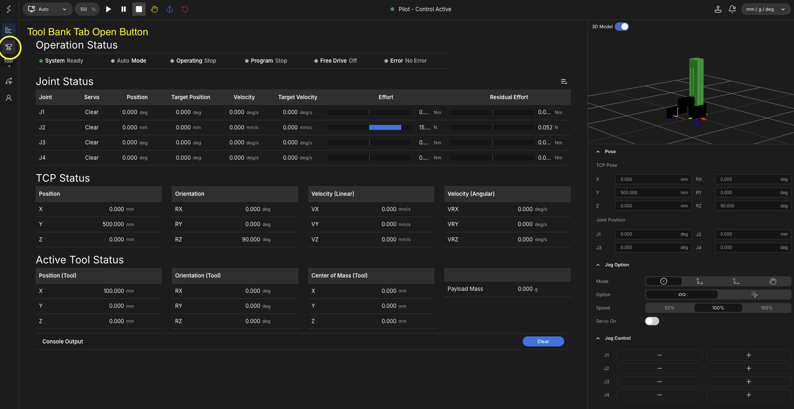
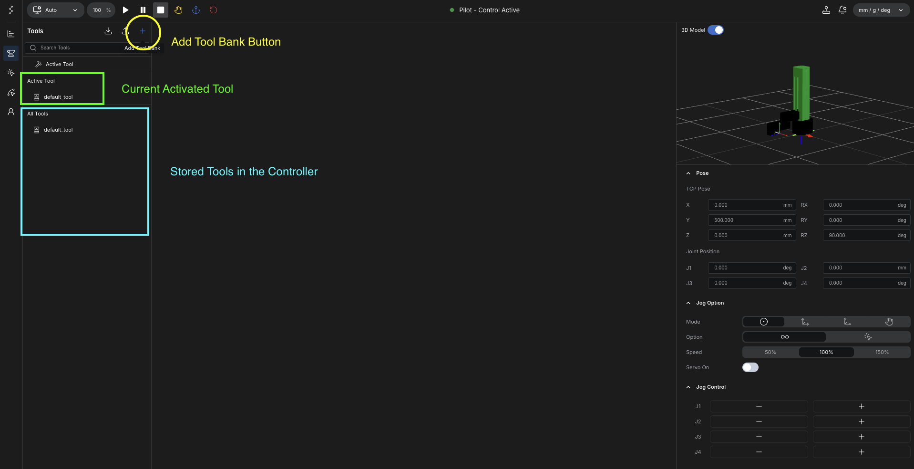
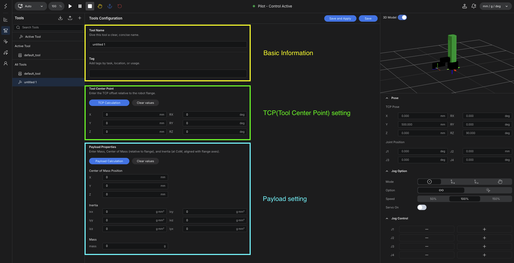

# Tool Bank

If an end-effector is attached, the tool should be configured before precise teaching or motion execution.

Tool Bank defines how the controller interprets the tool center point and payload relative to the robot flange.

It also allows multiple tool definitions to be stored and recalled as needed.

## Basic Flow

1. Open the tool tab from the main screen.
2. Create a new tool entry.
3. Enter the tool name and TCP offset values.
4. Save and apply the tool configuration.
5. Enter payload information if required.
6. Save and apply the payload settings.

## Open the Tool Tab

Tool Bank begins from the main screen.

Open the tool tab, then create a new tool entry before entering any TCP or payload values.

<figure markdown="span">
  { width="1200" }
  <figcaption>Open the Tool Bank tab from the main screen</figcaption>
</figure>

<figure markdown="span">
  { width="1200" }
  <figcaption>Current active tool, stored tool list, and the button used to add a new tool entry</figcaption>
</figure>

## Tool Name and TCP Offset

After creating the tool entry, enter the tool name and define the TCP offset.

The TCP offset describes the position of the actual tool center relative to the robot flange.

For example, if the tool extends forward from the flange, the TCP offset can be entered along the corresponding axis to reflect that length.

<figure markdown="span">
  { width="1200" }
  <figcaption>Tool name, TCP offset setting, and payload setting in Tool Bank</figcaption>
</figure>

Once the values are entered, save and apply the configuration.

Multiple tool definitions can be stored in Tool Bank, which allows the operator to switch between different end-effectors without re-entering the same values every time.

## Payload Setting

After the tool offset is configured, enter the payload information if required.

Payload data is important for controller behavior such as gravity compensation and stable motion response.

Typical payload items include:

- payload mass
- center of mass if required
- inertia values if required

After entering the payload values, save and apply the settings again.

## Stored Tool Definitions

Tool Bank is intended to keep multiple tool definitions available for reuse.

This is useful when:

- different end-effectors are used on the same robot
- tool length changes between tasks
- payload settings differ between applications
- operators need to switch quickly between saved tool profiles

## Why It Matters

Without the correct tool definition, the robot may interpret the end position incorrectly even when the arm itself moves as commanded.

This becomes especially important when:

- the tool length is significant
- the work position is tight
- repeated motion accuracy matters
- payload compensation affects the result
